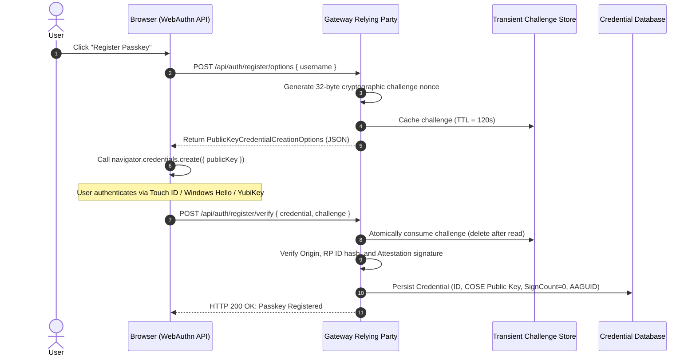
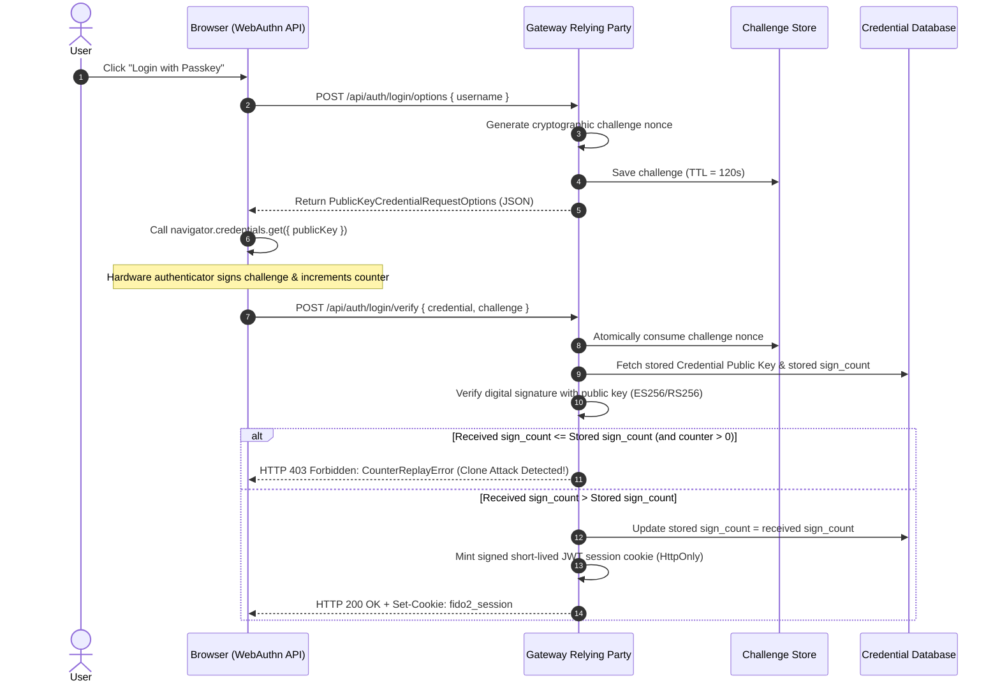
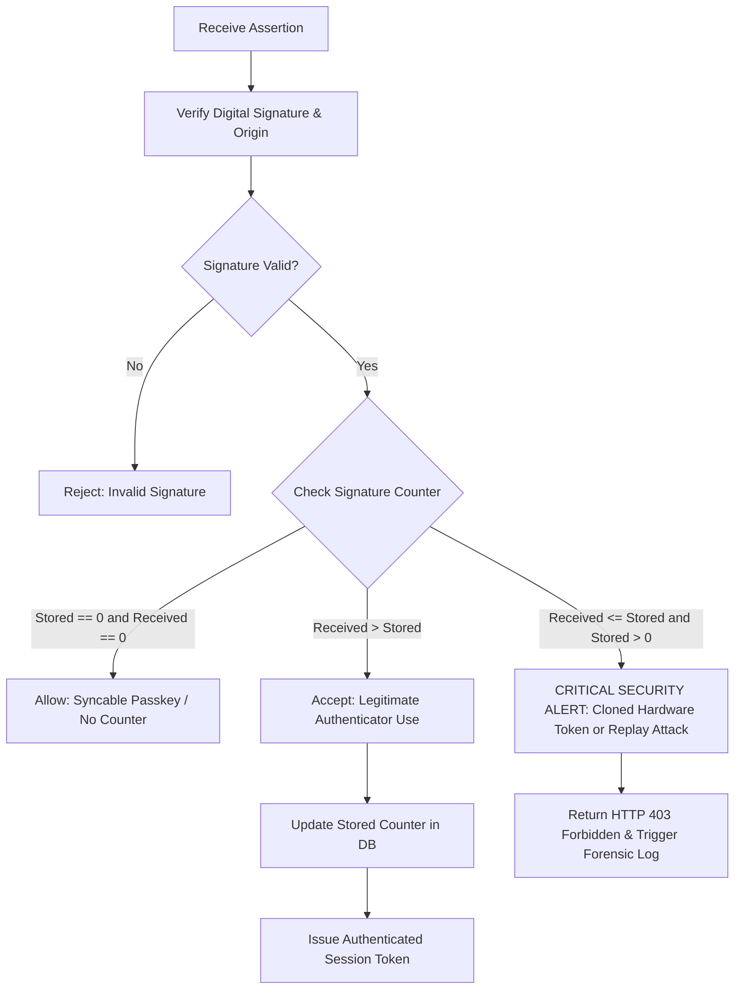

# Enterprise WebAuthn / FIDO2 Passwordless Identity Gateway

[](https://github.com/ravishkarathnayaka/Enterprise-WebAuthn-FIDO2-Passwordless-Identity-Gateway./actions/workflows/ci.yml)
[](https://github.com/ravishkarathnayaka/Enterprise-WebAuthn-FIDO2-Passwordless-Identity-Gateway./actions/workflows/security-scan.yml)
[](LICENSE)
[](https://www.python.org/downloads/)
[](https://www.w3.org/TR/webauthn-3/)
[](https://fido2-gateway-showcase.vercel.app/)

> **Live Interactive Showcase**: [https://fido2-gateway-showcase.vercel.app/](https://fido2-gateway-showcase.vercel.app/)

An open-source, production-ready **FIDO2 / WebAuthn Level 3 Relying Party (RP) backend and reverse proxy gateway** that replaces passwords with cryptographic, hardware-backed passkeys (such as Apple Touch ID / Face ID, Windows Hello, Android Biometrics, or physical YubiKeys).

Features strict cryptographic attestation verification (ES256, RS256, Ed25519), anti-replay signature counter verification (to detect cloned hardware keys), short-lived HttpOnly session tokens, step-up re-authentication policies for sensitive endpoints, and a headless automated test harness powered by Playwright and the Chrome DevTools Protocol (CDP) virtual authenticators ($0 test cost in CI without hardware keys).

---

## Architecture Overview

```
                                  [ Browser / Client ]
                                           │
                                  (1) Passkey Auth Ceremony
                                      navigator.credentials
                                           │
                                           ▼
┌────────────────────────────────────────────────────────────────────────────────────────┐
│                   ENTERPRISE WEBAUTHN IDENTITY GATEWAY (Port 8000)                     │
│                                                                                        │
│   ┌─────────────────────┐   ┌───────────────────────────┐   ┌──────────────────────┐   │
│   │ WebAuthn RP Engine  │   │ Anti-Replay Counter Guard │   │ Session Token Mint   │   │
│   │ (py_webauthn 3.0.0) │──▶│ (Monotonic Sign Count)    │──▶│ (JWT / HttpOnly)     │   │
│   └─────────────────────┘   └───────────────────────────┘   └──────────────────────┘   │
│              │                                                         │               │
│              ▼                                                         ▼               │
│   ┌─────────────────────┐                                   ┌──────────────────────┐   │
│   │ Challenge Store     │                                   │ Reverse Proxy Filter │   │
│   │ (Redis / Memory TTL)│                                   │ (auth_proxy.py)      │   │
│   └─────────────────────┘                                   └──────────────────────┘   │
└────────────────────────────────────────────────────────────────────────┼───────────────┘
                                                                         │
                                                 (2) Forwarded Requests with Identity Headers:
                                                     - X-Authenticated-User
                                                     - X-User-Id
                                                     - X-Passkey-Credential-Id
                                                     - X-User-Verified
                                                     - X-Auth-Time
                                                                         ▼
                                                    ┌──────────────────────────┐
                                                    │  UPSTREAM MICROSERVICE   │
                                                    │  (Port 8001 - Protected) │
                                                    └──────────────────────────┘
```

---

## Cryptographic Ceremony Sequence Diagrams

### 1. WebAuthn Registration Ceremony



---

### 2. WebAuthn Authentication & Anti-Replay Assertion Ceremony



---

### 3. Anti-Replay Counter Verification Logic



---

## Security Threat Model & Defense Matrix

| Threat Category | Attack Vector | Gateway Mitigation |
| :--- | :--- | :--- |
| **Phishing / Credential Harvesting** | Attacker creates clone domain (e.g. `login-enterprise.com`). | **Hardware Origin Binding**: Authenticators cryptographically hash the browser's origin. Mismatched origins fail assertion verification unconditionally. |
| **Credential Stuffing & Password Leaks** | Leaked databases on other sites used to breach enterprise accounts. | **Public-Key Cryptography**: Passwords do not exist. Only public keys are stored on the server; private keys never leave the hardware secure enclave. |
| **Man-in-the-Middle (MitM)** | Attacker proxies traffic between client and server. | **Cryptographic Nonce Binding**: The challenge nonce is signed over `clientDataJSON` and strictly valid for a single transaction (one-time use). |
| **Token Cloning & Emulation** | Physical key is cloned or virtual state snapshot copied. | **Monotonic Signature Counters**: The gateway rejects assertions where `received_sign_count <= stored_sign_count`, instantly detecting cloned devices. |
| **Session Hijacking & Session Fixation** | Injected JavaScript reads session credentials. | **Strict HttpOnly Cookies**: Session tokens use signed JWTs stored in `HttpOnly`, `SameSite=Lax`, and `Secure` cookies. |
| **Stale Privilege Escalation** | Attacker abuses an unattended open browser session for high-risk transfers. | **Step-Up Authentication**: Sensitive actions (`/api/admin/transfer`) mandate a fresh hardware passkey assertion within the previous 60 seconds. |

---

## Project Directory Layout

```text
├── .github/
│   └── workflows/
│       ├── ci.yml                 # Code linting, unit tests, and headless Playwright virtual authenticator tests
│       └── security-scan.yml      # Vulnerability scanning with Trivy and Gitleaks
├── docker/
│   ├── docker-compose.yml         # WebAuthn Gateway, Upstream Protected Service, and Redis
│   ├── nginx.conf                 # Hardened reverse proxy configuration with TLS termination
│   └── .env.example               # Environment template
├── gateway/
│   ├── __init__.py
│   ├── main.py                    # FastAPI application serving WebAuthn endpoints and proxying authenticated requests
│   ├── config.py                  # RP configuration (RP_ID, RP_NAME, EXPECTED_ORIGIN, algorithm preferences)
│   ├── crypto/
│   │   ├── __init__.py
│   │   ├── registration.py        # Generates registration options, verifies attestation statements, parses COSE keys
│   │   ├── authentication.py      # Generates auth options, validates assertion signatures, and checks anti-replay counters
│   │   └── tokens.py              # Issues and verifies signed, short-lived JWTs / HttpOnly session cookies
│   ├── storage/
│   │   ├── __init__.py
│   │   ├── database.py            # SQLite/PostgreSQL models for Users, Credentials (Public Keys, Credential IDs, Counters)
│   │   └── challenge_store.py     # Redis/Memory cache for transient challenge nonces with strict TTL expiration
│   ├── middleware/
│   │   ├── __init__.py
│   │   └── auth_proxy.py          # Reverse proxy middleware enforcing valid passkey session before upstream routing
│   └── static/
│       ├── index.html             # Clean web interface demonstrating Passkey Registration, Login, and Step-Up
│       └── webauthn_client.js     # Client-side JavaScript calling navigator.credentials.create() and get()
├── upstream_service/
│   ├── app.py                     # Sample protected backend API returning confidential data
│   ├── requirements.txt
│   └── Dockerfile
├── tests/
│   ├── test_crypto_verification.py# Unit tests evaluating raw CBOR/COSE parsing and signature validations
│   ├── test_counter_replay.py     # Unit tests ensuring replay attacks with cloned/frozen counters are rejected
│   └── test_e2e_virtual_auth.py   # Headless Playwright test using CDP to register and authenticate a virtual passkey
├── requirements.txt               # Root / gateway dependencies
├── gateway/Dockerfile             # Gateway container Dockerfile
├── .gitignore                     # Git ignore rules
├── LICENSE                        # MIT License
└── README.md                      # Architecture, sequence diagrams, and documentation
```

---

## Quickstart & Local Execution ($0 Zero-Cost Setup)

The application runs locally without any cloud subscriptions or external accounts.

### Option 1: Standalone Python Execution

#### 1. Install Dependencies
```bash
pip install -r requirements.txt
playwright install chromium
```

#### 2. Start Upstream Protected Microservice (Port 8001)
```bash
python -m uvicorn upstream_service.app:app --host 127.0.0.1 --port 8001
```

#### 3. Start WebAuthn Identity Gateway (Port 8000)
```bash
python -m uvicorn gateway.main:app --host 127.0.0.1 --port 8000
```

#### 4. Open the Web Portal
Visit [http://localhost:8000](http://localhost:8000) in your browser (Chrome, Edge, Safari, or Firefox).

---

### Option 2: Full Stack via Docker Compose

To launch the complete enterprise architecture with Redis caching, Gateway, Upstream microservice, and Nginx reverse proxy:

```bash
cd docker
docker compose up -d --build
```

- **Gateway Portal**: [http://localhost:8000](http://localhost:8000)
- **Nginx Hardened Proxy**: [http://localhost:8443](http://localhost:8443)
- **Upstream Direct Backend**: [http://localhost:8001](http://localhost:8001) (Direct unauthenticated access forbidden)

To tear down:
```bash
docker compose down -v
```

---

## Running Automated Tests

### 1. Cryptographic & Anti-Replay Unit Tests
Evaluates COSE key algorithms, WebAuthn options generation, JWT session tokens, challenge TTL expiration, and counter replay detection:

```bash
pytest tests/test_crypto_verification.py tests/test_counter_replay.py -v
```

### 2. Headless End-to-End Browser Tests (Chrome DevTools Protocol)
Spins up the entire system, enables a CTAP2 virtual authenticator via CDP (`WebAuthn.addVirtualAuthenticator`), registers a passkey, authenticates, proxies requests to the upstream backend, and verifies step-up authorization without any physical hardware keys:

```bash
pytest tests/test_e2e_virtual_auth.py -v
```

### 3. Run All Tests
```bash
pytest tests/ -v
```

---

## Testing in Your Browser

### Using Platform Hardware Authenticators
- **macOS / iOS**: Touch ID / Face ID / iCloud Keychain Passkey
- **Windows**: Windows Hello (PIN, Fingerprint, Facial Recognition)
- **Linux / Cross-Platform**: Physical FIDO2 Security Keys (YubiKey 5 Series, SoloKeys, Nitrokey)

### Using Chrome DevTools Virtual Authenticator
If you do not have a physical hardware key on your machine, you can use Chrome's built-in virtual authenticator:
1. Open [http://localhost:8000](http://localhost:8000) in Google Chrome.
2. Open **Chrome Developer Tools** (`F12` or `Ctrl+Shift+I` / `Cmd+Opt+I`).
3. Click the three dots menu in DevTools (`...`) > **More tools** > **WebAuthn**.
4. Check **Enable virtual authenticator environment**.
5. Click **Add authenticator** (Protocol: `ctap2`, Transport: `internal`, check `User Verification`, check `Resident Keys`).
6. In the Gateway UI, click **Register Passkey**, then **Login with Passkey**!

---

## Forensic Evidence: Anti-Replay Counter Detection

When an attacker attempts to replay an assertion response or utilizes a cloned hardware authenticator where the signature counter has not incremented:

### 1. Gateway Security Audit Log
```text
2026-09-16 21:38:53 [CRITICAL] [gateway.crypto.authentication]: [SECURITY ALERT] FIDO2 Counter Replay / Clone Attack detected! 
Credential ID: aXJ1OWZzN2FzZGY4YWFzZGZhc2Rm... | Stored sign_count: 10 | Error: Response sign count of 10 was not greater than current count of 10
2026-09-16 21:38:53 [CRITICAL] [gateway.main]: [CRITICAL SECURITY BREACH] Anti-replay counter violation for Credential ID=aXJ1OWZzN2Fz...: Cloned authenticator or replay attack detected.
```

### 2. Client HTTP Response
```http
HTTP/1.1 403 Forbidden
Content-Type: application/json

{
  "error": "counter_replay_detected",
  "message": "Potential cloned authenticator or replay attack detected. Signature counter not incremented.",
  "stored_counter": 10,
  "received_counter": 10
}
```

---

## Step-Up Re-Authentication Walkthrough

The Gateway enforces risk-based step-up authentication policies:
1. **Low-Risk Operations**: Standard authenticated session (valid for 60 minutes) allows general dashboard and reverse proxy access.
2. **High-Risk Operations** (e.g. `/api/admin/transfer`): Mandates that the hardware biometric or PIN assertion was executed within the previous **60 seconds**.
3. If `time() - auth_time > 60`, the gateway returns:
   ```json
   {
     "error": "step_up_required",
     "message": "Step-up authentication required: Re-authenticate with your WebAuthn passkey to authorize this transaction.",
     "max_age_seconds": 60,
     "auth_age_seconds": 94
   }
   ```
4. The client UI intercepts this response, triggers a swift `navigator.credentials.get()` ceremony to re-verify the user's presence and biometrics, and automatically re-executes the transaction.

---

## Enterprise Observability & Prometheus Telemetry

The gateway exposes a production-ready `/metrics` endpoint compatible with Prometheus, Grafana, and Datadog agents:

```text
# HELP webauthn_registration_requests_total Total number of WebAuthn registration ceremonies.
# TYPE webauthn_registration_requests_total counter
webauthn_registration_requests_total 24

# HELP webauthn_authentication_attempts_total Total WebAuthn authentication attempts by outcome.
# TYPE webauthn_authentication_attempts_total counter
webauthn_authentication_attempts_total{status="success"} 68
webauthn_authentication_attempts_total{status="replay_detected"} 3

# HELP webauthn_counter_replay_violations_total Number of detected cloned hardware key replay attempts.
# TYPE webauthn_counter_replay_violations_total counter
webauthn_counter_replay_violations_total 3

# HELP gateway_http_requests_total Total HTTP requests routed through Identity Gateway.
# TYPE gateway_http_requests_total counter
gateway_http_requests_total{method="POST",path="/api/auth/login/verify",status="200"} 68
```

A pre-configured Prometheus scraper is included in `docker/prometheus.yml` and orchestrated via `docker/docker-compose.yml` on port `9090`.

---

## Passkey Credential Lifecycle Management

The gateway provides RESTful endpoints to manage enrolled hardware passkeys and inspect FIDO2 AAGUID metadata:

- **List User Credentials**: `GET /api/credentials` (Returns active passkeys, AAGUIDs, assurance tiers, and transport capabilities)
- **Rename Passkey Label**: `PUT /api/credentials/{credential_id}` (`{"nickname": "Work MacBook Pro M3"}`)
- **Revoke Credential**: `DELETE /api/credentials/{credential_id}` (Quarantines and deletes the public key from the database)
- **Session Revocation**: `POST /api/auth/logout` (Blacklists active session tokens in Redis / memory cache)

---

## Deep Kubernetes Health & Readiness Probes

Designed for zero-downtime rolling Kubernetes deployments:
- **Liveness Probe**: `GET /health/liveness` (Confirms process event loop responsiveness)
- **Readiness Probe**: `GET /health/readiness` (Performs deep checks verifying SQLite/PostgreSQL connectivity, Redis challenge cache read/write, and cryptographic Relying Party initialization)

```json
{
  "status": "ready",
  "checks": {
    "database": "ok",
    "challenge_cache": "ok",
    "crypto_rp": "ok"
  },
  "rp_id": "localhost",
  "timestamp": 1727108400
}
```

---

## Architecture Decision Records (ADRs)

Key security and architectural choices are formally documented:
- [ADR-001: Monotonic Signature Counter Anti-Replay Verification](docs/adr/001-monotonic-counter-verification.md)
- [ADR-002: Zero-Trust Authenticator Attestation and AAGUID Evaluation](docs/adr/002-zero-trust-passkey-attestation.md)

---

## Security Policy & Incident Runbooks

For vulnerability disclosure and cloned hardware token containment procedures, refer to [SECURITY.md](SECURITY.md).

---

## License

This project is licensed under the [MIT License](LICENSE).
